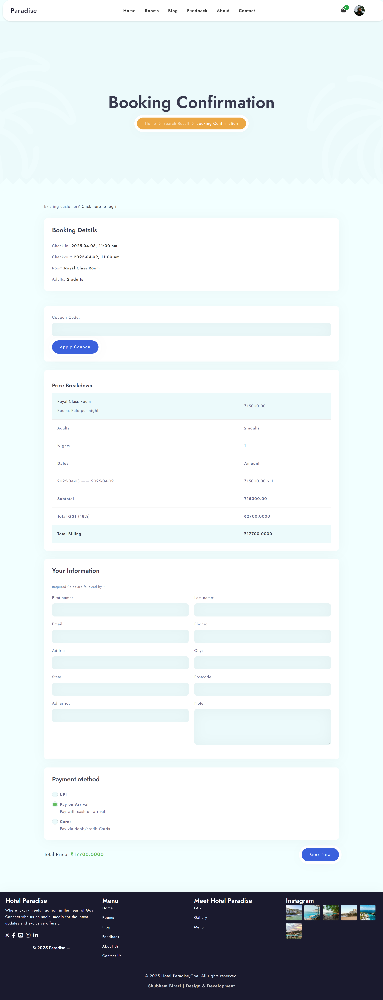
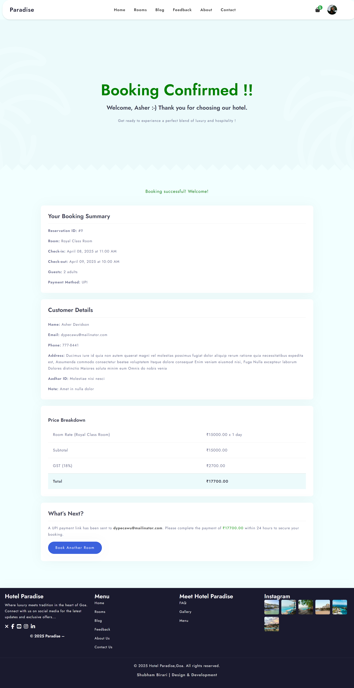
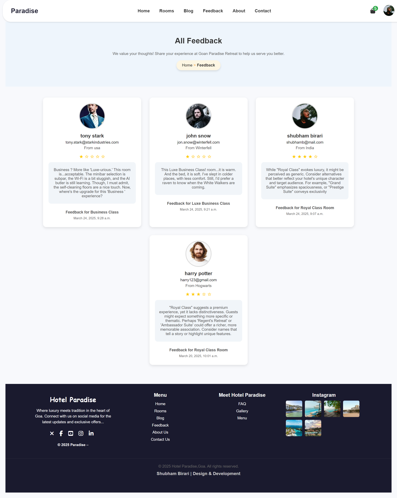


# https://shubhamb.pythonanywhere.com
**Note**:To view this website on mobile and tablets, toggle the "Desktop site" option in your browser.

# Hotel Management System

A full-stack hotel management system that allows users to book rooms, manage reservations, and handle hotel operations efficiently. This project is built using modern web technologies.

## Live Demo

The project has been deployed and is accessible at the following link:

### https://shubhamb.pythonanywhere.com

**Note**: The website is hosted on a free-tier server and cannot handle high traffic. Please visit one at a time to ensure smooth performance. 

## About the Project

This project is a FullStack Python hotel management system designed to streamline hotel operations. It includes features for room booking, customer management, and more. The backend is powered by Python (Django), and the frontend is built with modern web technologies.

## Features

- Room booking system
- Customer management
- Admin dashboard
- Hotel blogs (CRUD operations)
- Feedback
- Responsive design


## Setup Instructions

1. Clone the repository:
   ```bash
   git clone https://github.com/shubhambirari3/Hotel_DjangoFullStack
   ```
2. Navigate to the project directory:
   ```bash
   cd hotel-management-system
   ```
3. Follow the installation steps below.

## Installation

1. Install the required dependencies:
   ```bash
   pip install -r requirements.txt
   ```
2. Run database migrations:
   ```bash
   python manage.py migrate
   ```
3. Start the development server:
   ```bash
   python manage.py runserver
   ```
4. Visit the application in your browser:
   ```
   http://127.0.0.1:8000/
   ```

## License

This project is licensed under the MIT License. See the [LICENSE](LICENSE) file for details.

## Contributing

Contributions are welcome! Please follow these steps to contribute:
1. Fork the repository.
2. Create a new branch for your feature or bug fix.
3. Commit your changes and push them to your fork.
4. Submit a pull request.

## Screenshots
*Homepage of the application.*


*Roompage of the application.*


*Booking-check-in page of the application.*

 

*Booking-check-out page of the application.*



*blog of the application.*


*feedback of the application.*




